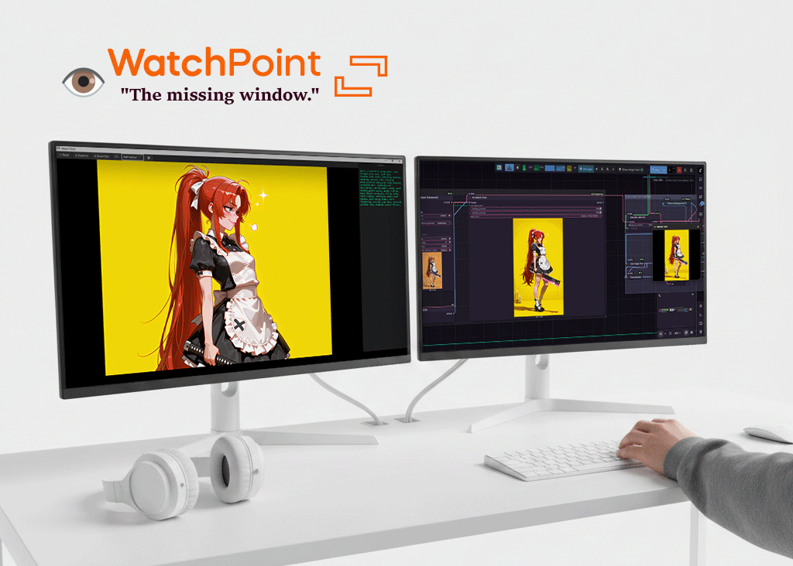
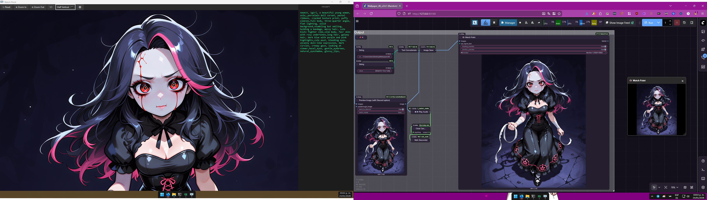

# 👁️ ComfyUI Watch Point



**Dual preview system for ComfyUI workflows**

### About This Project
This node was developed by a creator with limited Python experience, using AI tools like Claude, Gemini, and Kimi. While fully functional, it may not strictly adhere to all Python best practices. 

We warmly invite you to fork, improve, and adapt this code—collaboration is what makes open-source thrive!

Watch Point provides two simultaneous preview methods:
- Monitor Preview: External Tkinter window on any monitor
- Floating Preview: ComfyUI's built-in preview system

---


---

## 🔧 Features

### Monitor Preview (Tkinter)
- Display on any connected monitor
- Zoom/Pan controls with mouse
- Keyboard shortcuts
- Save images directly from preview
- Copy to clipboard
- Customizable settings
- Signal Scout Panel: Display text from your workflow in a side panel.
- Thread Safety: Windows minimize instead of closing to prevent ComfyUI crashes

### Floating Preview (JavaScript)
- Uses ComfyUI's native preview system
- Works with existing preview extensions
- Auto-updates during workflow execution
- Configurable via browser localStorage (no file editing)
- Customizable keyboard shortcuts
- Snap-to-grid positioning
- Adjustable opacity levels

---

## 🛡️ Thread Safety & Window Protection

WatchPoint includes built-in protection against threading issues that can crash ComfyUI:

### Window Minimization Protection
- **Close Button Behavior**: Clicking the Windows close button minimizes the window instead of closing it
- **Thread Safety**: Prevents `Tcl_AsyncDelete` errors and threading conflicts
- **ComfyUI Stability**: Ensures ComfyUI continues running even if windows are "minimized"
- **Window Recovery**: Minimized windows can be restored from the taskbar

### Technical Details
- Uses thread-safe Tkinter operations
- Implements proper cleanup procedures
- Prevents memory leaks and threading deadlocks
- Global window management for consistent behavior

---

## 📦 Installation

1. Clone into your ComfyUI custom_nodes directory:
```bash
cd ComfyUI/custom_nodes
git clone [https://github.com/gmorks/ComfyUI-WatchPoint.git](https://github.com/gmorks/ComfyUI-WatchPoint.git)

```

2. Install dependencies (if needed):

```bash
pip install pillow screeninfo

```

3. Restart ComfyUI

---

## 👁️ Nodes

### Watch Point

The main preview node.

1. Add **Watch Point** to your workflow.
2. Connect an `IMAGE` input.
3. Enable/disable previews:
* `floating_preview`: Enable ComfyUI's built-in preview.
* `monitor_preview`: Enable the external monitor window.


4. Select the target `monitor` from the dropdown.
5. The node acts as a pass-through for the `IMAGE` output.

### WP Signal Scout

A debug node to send text to the Monitor Preview window.

1. Add **WP Signal Scout** to your workflow (found in `WatchPoint/Debug`).
2. Connect any `STRING` input.
3. The text will appear in the side panel of the external window.

### Utility Nodes (Optional)

These nodes provide additional functionality and can be enabled/disabled via configuration.

#### WatchPoint Debug Toggle

A simple node to enable/disable persistent debug mode for WatchPoint nodes.

* **Function**: Toggle debug mode with a single click
* **Location**: `WatchPoint/Utils` (when enabled)
* **Usage**: Connect to any workflow to activate debug logging

#### WatchPoint Restore Window

A utility node to restore minimized WatchPoint windows.

* **Function**: Recover hidden/minimized windows
* **Location**: `WatchPoint/Utils` (when enabled)
* **Usage**: Add to workflow when windows need restoration

**Note**: Utility nodes are loaded optionally. To enable/disable them, modify the `__init__.py` file.

### Example Workflow

```
[Primitive] → [WP Signal Scout]
   (text)          ↓ (sends text to window)

[Load Image] → [Watch Point] → [Upscale] → [Save Image]
                     ↓
              (Dual Preview)

```

---

## 🎮 Controls (Monitor Preview)

### Mouse

* **Scroll wheel**: Zoom in/out
* **Left click + drag**: Pan image
* **Right click**: Context menu

### Keyboard

* **R**: Reset zoom and pan
* **T**: Toggle toolbar
* **P**: Toggle Signal Scout panel
* **1**: Zoom 1:1 (100% actual size)
* **ESC**: Close window

### Window Close Behavior

**Important**: The Windows close button (❌) minimizes the window instead of closing it. This prevents threading errors and keeps ComfyUI stable. To "close" the window:

* Click the close button → Window minimizes to taskbar
* Use **ESC** key to properly close the window
* Right-click taskbar icon → "Close window" for forced closure

### Toolbar Buttons

* **↻ Reset**: Reset zoom and pan
* **⊕ Zoom In**: Increase zoom level
* **⊖ Zoom Out**: Decrease zoom level
* **1:1 (100%)**: View image at actual size
* **Window Size**: Quick resize presets
* **⛶ Fullscreen**: Toggle fullscreen mode
* **⚙ Settings**: Open settings dialog

---

## ⚙️ Settings

Access settings via the **⚙ Settings** button in the toolbar.

### Window Size

* Fixed sizes: 800x600, 1024x768, 1280x720, 1920x1080
* Dynamic sizes:
* **Half Vertical**: Half screen width, full height
* **Half Horizontal**: Full width, half screen height
* **Quarter**: Half width, half height


### Window Position

* Set exact X, Y coordinates for window placement
* Leave empty for automatic positioning
* Example: X=0, Y=0 for top-left corner

### Save Options

* Default format: PNG, JPEG, or WebP
* JPEG quality slider (10-100)

### UI Options

* Show/hide toolbar by default

All settings are saved to `watchpoint_settings.json`

---

## 🔧 Utility Nodes Configuration

Utility nodes (WatchPoint Debug Toggle and WatchPoint Restore Window) are optional and can be enabled/disabled:

### Enabling Utility Nodes

1. Open `__init__.py` in the ComfyUI-WatchPoint folder
2. Ensure the import block is uncommented:

```python
try:
    from .nodes.watchpoint_utils import NODE_CLASS_MAPPINGS as UTILS_CLASS, NODE_DISPLAY_NAME_MAPPINGS as UTILS_DISPLAY
    NODE_CLASS_MAPPINGS.update(UTILS_CLASS)
    NODE_DISPLAY_NAME_MAPPINGS.update(UTILS_DISPLAY)
    print("WatchPoint Utils loaded: Debug Toggle and Restore Window available")
except ImportError as e:
    print(f"WatchPoint Utils not available: {e}")
    pass

```

### Disabling Utility Nodes

Comment out or remove the import block in `__init__.py` to disable utility nodes.

---

## 🔧 Configuration Files

### Monitor Preview Settings

Edit `watchpoint_settings.json` to customize defaults for the external Tkinter window:

```json
{
  "window_width": 800,
  "window_height": 600,
  "window_x": null,
  "window_y": null,
  "window_size_mode": "fixed",
  "show_toolbar": true,
  "save_format": "png",
  "jpeg_quality": 90
}

```

#### Settings Explained

* `window_x`, `window_y`: Window position (null = auto)
* `window_size_mode`: "fixed", "Half Vertical", "Half Horizontal", or "Quarter"
* `show_toolbar`: Show toolbar on startup
* `save_format`: Default save format ("png", "jpeg", "webp")
* `jpeg_quality`: JPEG compression quality (10-100)

### Floating Preview Configuration

The floating preview window is configured via browser localStorage. No file editing required!

#### Quick Start

**View Current Configuration**

Open browser console (F12) and run:

```javascript
WatchPointFloating.getConfig()

```

**Change Configuration**

```javascript
WatchPointFloating.setConfig({
    window: {
        defaultWidth: 500,
        defaultHeight: 500,
        defaultPosition: "top-right",
        defaultOpacity: 80
    },
    shortcuts: {
        toggle: "Ctrl+Alt+KeyP"  // Change toggle shortcut
    }
})

```

**Reset to Defaults**

```javascript
WatchPointFloating.resetConfig()

```

**Show Help**

```javascript
WatchPointFloating.showHelp()

```

**Note**: Reload the page after changing config to apply changes.

#### Available Configuration Options

##### Window Settings

```javascript
{
    window: {
        defaultWidth: 320,           // Width in pixels
        defaultHeight: 320,          // Height in pixels
        defaultPosition: "middle-right", // Initial position
        defaultOpacity: 100          // 0-100 (percentage)
    }
}

```

**Available Positions**:

* `"top-left"`, `"top-center"`, `"top-right"`
* `"middle-left"`, `"middle-center"`, `"middle-right"`
* `"bottom-left"`, `"bottom-center"`, `"bottom-right"`

##### Opacity Settings

```javascript
{
    opacity: {
        levels: [20, 40, 60, 80, 100],  // Available opacity levels (%)
        showIndicator: true,             // Show opacity % when changing
        indicatorDuration: 1000          // How long indicator shows (ms)
    }
}

```

##### UI Settings

```javascript
{
    ui: {
        showHeader: true,          // Show title bar
        showTitle: true,           // Show "👁️ Watch Point" title
        showCloseButton: true,     // Show X button
        dragFromAnywhere: false    // Drag from image area (only if header=false)
    }
}

```

##### Keyboard Shortcuts

```javascript
{
    shortcuts: {
        // Main controls
        toggle: "Ctrl+Alt+KeyW",
        increaseOpacity: "Ctrl+Alt+Equal",    // or Ctrl+Alt++
        decreaseOpacity: "Ctrl+Alt+Minus",    // or Ctrl+Alt+-
        
        // Arrow navigation (relative)
        snapUp: "Ctrl+Alt+ArrowUp",
        snapDown: "Ctrl+Alt+ArrowDown",
        snapLeft: "Ctrl+Alt+ArrowLeft",
        snapRight: "Ctrl+Alt+ArrowRight",
        
        // Numpad navigation (absolute positions)
        snapToPosition7: "Ctrl+Alt+Numpad7",  // Top-left
        snapToPosition8: "Ctrl+Alt+Numpad8",  // Top-center
        snapToPosition9: "Ctrl+Alt+Numpad9",  // Top-right
        snapToPosition4: "Ctrl+Alt+Numpad4",  // Middle-left
        snapToPosition5: "Ctrl+Alt+Numpad5",  // Middle-center
        snapToPosition6: "Ctrl+Alt+Numpad6",  // Middle-right
        snapToPosition1: "Ctrl+Alt+Numpad1",  // Bottom-left
        snapToPosition2: "Ctrl+Alt+Numpad2",  // Bottom-center
        snapToPosition3: "Ctrl+Alt+Numpad3"   // Bottom-right
    }
}

```

#### Default Keyboard Shortcuts

| Action | Shortcut | Description |
| --- | --- | --- |
| **Toggle window** | `Ctrl+Alt+W` | Show/hide floating preview |
| **Increase opacity** | `Ctrl+Alt++` | Make more opaque |
| **Decrease opacity** | `Ctrl+Alt+-` | Make more transparent |
| **Move up** | `Ctrl+Alt+↑` | Snap to position above |
| **Move down** | `Ctrl+Alt+↓` | Snap to position below |
| **Move left** | `Ctrl+Alt+←` | Snap to position left |
| **Move right** | `Ctrl+Alt+→` | Snap to position right |
| **Snap to corner** | `Ctrl+Alt+Numpad[1-9]` | Jump to specific position |

#### Storage Location

Configuration is stored in browser localStorage under the key:

```
watchpoint-floating-config

```

---

## Use Cases

### Dual Monitor Setup

Perfect for users with multiple monitors:

* Work on ComfyUI on main monitor
* View live preview on secondary monitor
* No need to switch windows or tabs

### Quality Control

Use 1:1 zoom to inspect:

* Image quality at pixel level
* Upscaling artifacts
* Detail preservation

### Live Monitoring

Watch your workflow progress in real-time:

* Both previews update simultaneously
* Choose the view that works best for your setup
* Keep an eye on intermediate results

---

## Requirements

* Python 3.7+
* tkinter (usually included with Python)
* PIL/Pillow
* screeninfo (optional, for multi-monitor detection)

---

## Optional Dependencies

For clipboard support (Windows):

```bash
pip install pywin32

```

---

## 🛠️ Troubleshooting

### Window doesn't appear

* Check if `monitor_preview` is enabled (True)
* Try different monitor selection
* Check console for error messages

### Window appears in wrong location

* Set explicit X, Y coordinates in settings
* Use `window_x: 0, window_y: 0` for top-left

### Image not updating

* Ensure workflow is executing
* Check that image is connected to Watch Point input
* Try disabling/re-enabling monitor preview

### Floating preview not working

* Ensure `floating_preview` is enabled (True)
* Check if other preview extensions are conflicting
* Restart ComfyUI

---

## Credits

Vibe Coded for ComfyUI by gmorks using AI.

---

## License

MIT License - Feel free to use and modify!

---

## 🚧 Development Status

**Note**: This extension is not yet compatible with ComfyUI Nodes 2.0. Support for the new node system is on our to-do list and will be implemented in a future update.

---

## Recent Changes

### v1.0.0 - Initial Release

* Dual preview system (Monitor + Floating)
* Signal Scout text display
* Basic window controls and settings
* Multi-monitor support
